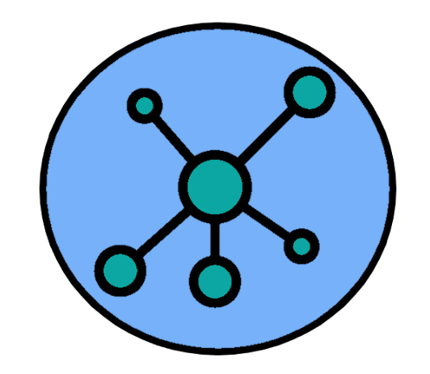

<h1 align="center">
    
    <p>Stack Social</p>
</h1>

# 📄About

<p> The <b>Stack Social</b> is an application for sharing things or experience about programming. You just need to register your account and create a post.</p>

# 💻 Technologies 

<h2> The project was developed using the following technologies:

<ul>
    <li><p></b>ReactJS</b></p></li>
    <li><p></b>NodeJS</b></p></li>
    <li><p></b>Typescript</b></p></li>
</ul>

# ✔ How to use the project

````
# In the backend folder

## Installing the dependencies

$ yarn 

## Running migrations

$ yarn knex:migration

## Running server

$ yarn dev:server

# In the backend folder

## Installing the dependencies

$ yarn 

## Starting application

$ yarn start

